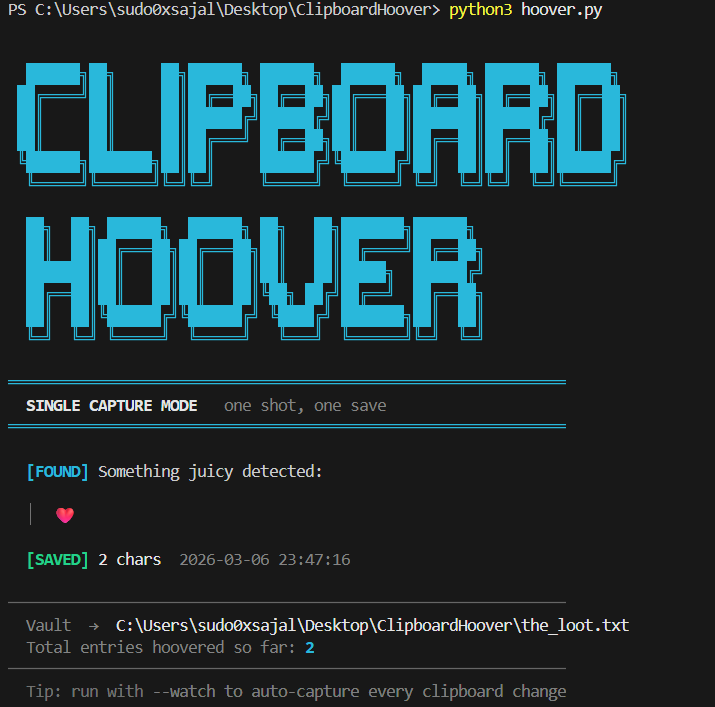

<div align="center">

```
  ██████╗██╗     ██╗██████╗ ██████╗  ██████╗  █████╗ ██████╗ ██████╗ 
 ██╔════╝██║     ██║██╔══██╗██╔══██╗██╔═══██╗██╔══██╗██╔══██╗██╔══██╗
 ██║     ██║     ██║██████╔╝██████╔╝██║   ██║███████║██████╔╝██║  ██║
 ██║     ██║     ██║██╔═══╝ ██╔══██╗██║   ██║██╔══██║██╔══██╗██║  ██║
 ╚██████╗███████╗██║██║     ██████╔╝╚██████╔╝██║  ██║██║  ██║██████╔╝
  ╚═════╝╚══════╝╚═╝╚═╝     ╚═════╝  ╚═════╝ ╚═╝  ╚═╝╚═╝  ╚═╝╚═════╝ 
  ██╗  ██╗ ██████╗  ██████╗ ██╗   ██╗███████╗██████╗ 
  ██║  ██║██╔═══██╗██╔═══██╗██║   ██║██╔════╝██╔══██╗
  ███████║██║   ██║██║   ██║██║   ██║█████╗  ██████╔╝
  ██╔══██║██║   ██║██║   ██║╚██╗ ██╔╝██╔══╝  ██╔══██╗
  ██║  ██║╚██████╔╝╚██████╔╝ ╚████╔╝ ███████╗██║  ██║
  ╚═╝  ╚═╝ ╚═════╝  ╚═════╝   ╚═══╝  ╚══════╝╚═╝  ╚═╝
```

**The clipboard vacuum that never stops sucking.**


</div>

---

## What is this?

**ClipboardHoover** is a lightweight Python CLI tool that vacuums up everything you copy and logs it to a plain-text vault — timestamped, searchable, and eternally remembered.

Two modes:
- **Single capture** — run once, save what's in your clipboard right now, exit.
- **Watch mode** — runs silently in the background, auto-saves every new clipboard change the moment it happens. Stop it with `Ctrl+C`.

Perfect for hoarding code snippets, URLs, quotes, error messages, rants, and everything else you Ctrl+C but lose 10 minutes later.

---

## Features

- Beautiful terminal UI with colors, ASCII art banner, and clean status output
- Duplicate detection — never logs the same content twice in a row
- Live preview of captured content in the terminal
- Session stats on exit (how many entries captured, total vault size)
- UTF-8 safe — handles emojis, Bengali, Arabic, code, anything
- Zero dependencies beyond `pyperclip`
- No background daemon, no config files, no database — just one `.txt` vault

---

## File Structure

```
ClipboardHoover/
├── hoover.py          # The vacuum — main script
├── requirements.txt   # The one thing it needs
├── .gitignore         # Keeps the vault out of git
├── LICENSE            # MIT
└── README.md          # You are here
```

---

## Installation

```bash
git clone https://github.com/Sudo0xSajal/ClipboardHoover.git
cd ClipboardHoover

pip install -r requirements.txt
```

---

## Usage

### Single capture (one shot)
```bash
python hoover.py
```
Grabs whatever is in your clipboard right now, saves it, exits.

### Watch mode (background vacuum)
```bash
python hoover.py --watch
```
Stays alive, polls every 1.2 seconds, auto-saves every new clipboard change.  
Press **Ctrl+C** to stop — it will print a clean session summary and exit.

---

## Example Terminal Output



---

## The Vault (`the_loot.txt`)

All captured entries are appended here:

```
[2026-03-06 23:17:45]
https://github.com/Sudo0xSajal
────────────────────────────────────────────────────────────────────────────────
[2026-03-06 23:44:12]
def cursed_function(): return lambda: lambda: None
────────────────────────────────────────────────────────────────────────────────
[2026-03-06 23:51:09]
কলকাতার রাস্তায় কত টাকা লাগবে ভাই?
────────────────────────────────────────────────────────────────────────────────
```

Plain text. Human-readable. `grep`-able. Permanent.

> The vault file (`the_loot.txt`) is excluded from git via `.gitignore` — your copied secrets stay local.

---

## License

[MIT](LICENSE) — do whatever you want, but don't blame me if your clipboard history exposes your dark secrets.

---

<div align="center">
Made with chaotic energy in Kolkata · 2026<br>
<i>Star it if your clipboard deserves eternal memory.</i>
</div>